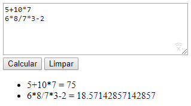

# exprparser

O software deste repositório utiliza um parser criado com [ANTLR](http://antlr.org) para calcular valores de expressões aritméticas. No momento são válidas as sintaxes:

* `expressão * expressão`
* `expressão / expressão`
* `expressão + expressão`
* `expressão - expressão`

Onde `expressão` é um número inteiro.

A figura a seguir ilustra a tela do software.

A caixa de texto permite entrar com uma expressão aritmética por linha. Ao pressionar *Calcular* as expressões serão avaliadas e elas e seus valores serão apresentados na parte inferior da tela.

## Ferramentas

Para que o software funcione é necessário fazer download do [ANTLR runtime para JavaScript](https://www.antlr.org/download/antlr-javascript-runtime-4.7.2.zip) e também utilizar um servidor web para arquivos estáticos (como o *HttpServer* ou a extensão *Live Server* para o VSCode). 

O runtime deve ser descompactado na pasta raiz do software (criando o caminho `./antlr4`).

O software também utiliza a biblioteca *require.js* disponibilizada no repositório do [antlr](https://github.com/antlr/antlr4/blob/master/runtime/JavaScript/src/lib/require.js) (não é necessário fazer download dela, pois já está em `./lib/require.js`).

## Nota

Este software é uma demonstração dos conceitos de compiladores e da utilização do ANTLR para criá-los (análise léxica, análise sintática, análise semântica, gramática).

